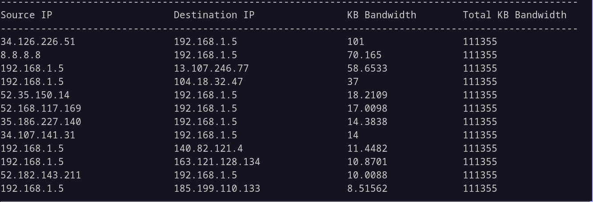
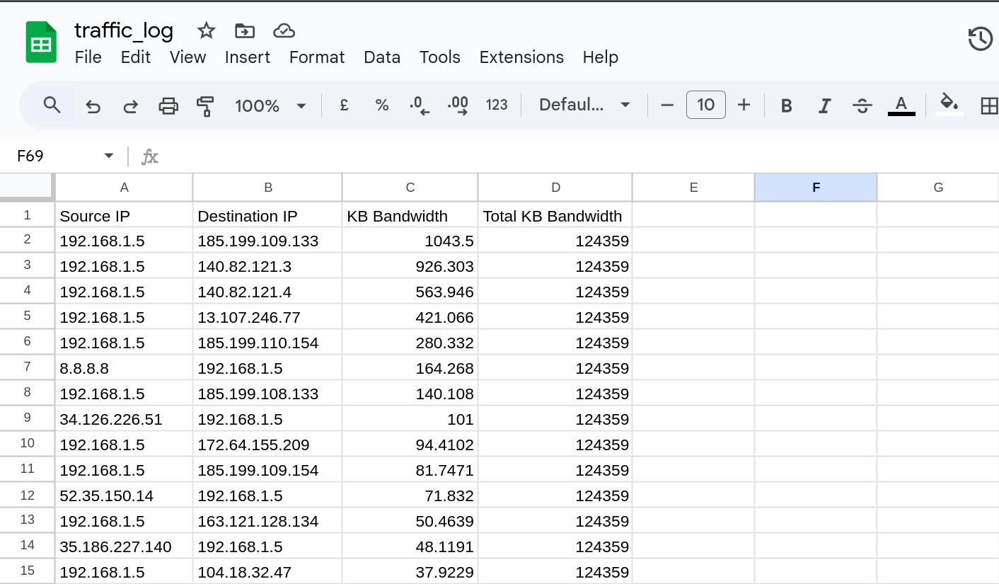

# **📡 Introduction**
PacketX is a **lightweight high-performance software** for real-time capturing and analyzing network traffic. This project leverages `linux`, `tcpdump`, `tshark`, `bash` and `c++` to inspect network packets and identify high-bandwidth applications utilizing **multithreaded C++, **mutex-controlled data synchronization**, **managing local files,** and **automated build** using **Makefiles**.

<br/>

## **🚀 Features**
✅ **Capture Network Traffic** using `tcpdump` for raw packet collection.  
✅ **Analyze Bandwidth Usage** with `tshark` and `c++` to break down traffic.  
✅ **Identify High Data Usage Apps** by inspecting UDP/TCP connections.  
✅ **Real Time Traffic Monitoring** with `bash` and `c++`.   
✅ **Save Analyzed Captured State**.   

<br/>


## **🎬 Demo**


<br/>

## **🚀 How To Run**
- Install `tcpdump` and `tshark` if not already.
```bash
sudo apt install tcpdump tshark
```

- Compile `C++` with `Makefile`
```bach
make
```

- Run the `tcpdump_capture.sh` bash script giving 2 arguments
	1. Network interface name that you want to capture its traffic
	2. Time chunk of capture, this will affect the update speed in the c++ program too, if you want to see whats going on in real time, 5 or 10 seconds is a good choice

```bash
sudo ./tcpdump_capture.sh wlp8s0 10
```

- Run the `C++` program 
```bash
./main
```


<br/>

## **🚀 State Saving**
The processed captured traffic is saved in a csv file `traffic_log.csv`, the program will use this data a starting point if the file exists.

