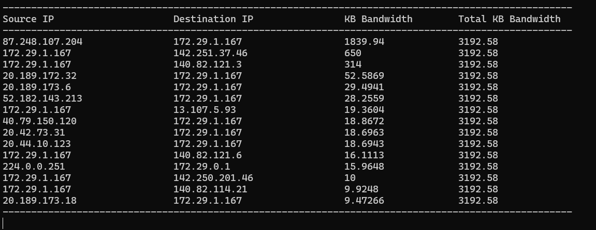

<!--  -->

# **📡 Introduction**
PacketX Lakehouse is a Cloud & Local based medium-sized data platform designed to handle and analyze network packets traffic data.The project follows a modern medium-sized lakehouse architecture, integrating **Apache Iceberg, AWS S3 Bucket Storage, DynamoDB, and Redshift**.


### Data Source & Ingestion
The data powering the Lakehouse comes from the PacketX logged data repository ([PacketX](https://github.com/eslamdyab21/PacketX)), where real-time network traffic data is generated from devices.

PacketX is a **lightweight high-performance software** for real-time capturing and analyzing network traffic. It leverages `linux`, `tcpdump`, `tshark`, `bash` and `c++` to inspect network packets and identify high-bandwidth applications utilizing **multithreaded C++, **mutex-controlled data synchronization**, **managing local files,** and **automated build** using **Makefiles**.


<br/>
<br/>


# **🎬 Walk Through**
## 1. Upload Raw Data To Lakehouse
`PacketX` project writes captured network traffic data periodically each one minute to the corresponding date csv file in a traffic_log directory.

```bash
(.venv) PacketX$ ls traffic_log/
dyab-2025-03-20.csv  dyab-2025-03-23.csv  dyab-2025-03-26.csv  dyab-2025-03-29.csv
dyab-2025-03-21.csv  dyab-2025-03-24.csv  dyab-2025-03-27.csv  dyab-2025-03-30.csv
dyab-2025-03-22.csv  dyab-2025-03-25.csv  dyab-2025-03-28.csv
(.venv) PacketX$
```

So we can setup a `cronjob` to upload the day data at the end of each day or invoke the script manually.

### To AWS S3
A script `upload_to_s3.py` is used to upload relevant day raw data to S3, it basically connects to S3 Bucket with `boto3 module` with credintails in the `.env` file and configurations in the `conf` file.

- An example of the `.env` structure:
```python
aws_access_key_id='SSSSSSSSSSSSSSSSSSSSS'
aws_secret_access_key='SSSSSSSSSSSSSSSSSSSSSSSS'
s3_bucket_name='bucket-name'
```

- An example of the `conf` structure:
```python
[Upload To S3]
local_csv_dir_path = /home/dyab/projects/PacketX/traffic_log/
s3_object_key_path = lakehouse/raw_data_upload/
csv_file_name = dyab-2025-03-23.csv
```

The scripts will first compress the csv file to `.gz` then upload to S3


<br/>

## 2. Raw Data Table Format
Now, to have the ability to query the raw data and process it further in the pipeline, we will use `Iceberg` which will allow us to do just that and more with its efficient storage in `parquet` format, `ACID` transactions, partitioning, and `metadata` fast performance analytical queries. 

The traditional route with `Iceberg` is to use it on big data with tools like `spark`, but in this project since the data volume is small to mid, we won't use it with `spark`, we will use `pandas` and `pyarrow` with the relatively new `Pyiceberg` which is a Python implementation for accessing Iceberg tables without the need of a JVM.

### To AWS With Glue Catalog and S3
An ETL script `raw_s3_iceberg_etl.py` is used to process relevant day raw data from `lakehouse/raw_data_upload/` to `iceberg` table format in `lakehouse/iceberg` in `S3`, with `PacketX_Raw` namespace and a `Packets` table.

- The `.env` remains the same:
```python
aws_access_key_id='SSSSSSSSSSSSSSSSSSSSS'
aws_secret_access_key='SSSSSSSSSSSSSSSSSSSSSSSS'
s3_bucket_name='bucket-name'
```

- The `conf` structure will have new configurations:
```python
[Upload To S3]
local_csv_dir_path = /home/dyab/projects/PacketX/traffic_log/
s3_object_key_path = lakehouse/raw_data_upload/
csv_file_name = dyab-2025-03-23.csv

[Raw S3 Iceberg Lakehouse ETL]
local_gz_dir_path = /home/dyab/projects/PacketX/traffic_log/
s3_lakehouse_path = lakehouse/iceberg
gz_file_name = dyab-2025-03-23.gz
region_name = eu-north-1
```

- The main flow of the ETL
```python
# ----- Glue Catalog S3 Iceberg Path -----
catalog = load_s3_glue_catalog(s3_lakehouse_path, region_name)
create_raw_schema(catalog = catalog, name_space = 'PacketX_Raw', table_name = 'Packets')
iceberg_table = catalog.load_table("PacketX_Raw.Packets")
df = read_s3_csv_file(s3_object_key_path, gz_file_name)
upsert_new_df(df, iceberg_table)
# ----- Glue Catalog S3 Iceberg Path -----
```


### To Local With SQLLite Catalog
Same `.env`, `conf`, and ETL script is used, the only difference is with catalog function and and reading the raw data.
```python
# ----- SQL Lite Local Path -----
catalog = load_local_sqlite_catalog()
create_raw_schema(catalog = catalog, name_space = 'PacketX_Raw', table_name = 'Packets')
iceberg_table = catalog.load_table("PacketX_Raw.Packets")
df = read_local_csv_file(local_gz_dir_path + gz_file_name)
upsert_new_df(df, iceberg_table)
# ----- SQL Lite Local Path -----
```


