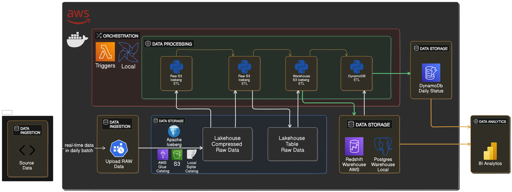

# **📡 Introduction**
PacketX Lakehouse is a Cloud & Local based medium-sized data platform designed to handle and analyze network packets traffic data. The project follows a modern medium-sized lakehouse architecture, integrating **Apache Iceberg & AWS S3 Bucket Storage (Lakehouse), Redshift & Postgres (Warehouse), DynamoDB, Docker, and Apache Airflow for ETL pipeline orchestration and scheduling**


### Data Source & Ingestion
The data powering the Lakehouse comes from the PacketX logged data repository ([**PacketX**](https://github.com/eslamdyab21/PacketX)), where real-time network traffic data is generated from devices.

PacketX is a **lightweight high-performance software** for real-time capturing and analyzing network traffic. It leverages `linux`, `tcpdump`, `tshark`, `bash` and `c++` to inspect network packets and identify high-bandwidth applications utilizing **multithreaded C++, **mutex-controlled data synchronization**, **managing local files,** and **automated build** using **Makefiles**.


<br/>
<br/>


# **🎬 Walk Through**


## 1. Upload Raw Data To Lakehouse
`PacketX` project writes captured network traffic data periodically each one minute to the corresponding date csv file in a traffic_log directory.

```bash
(.venv) PacketX$ ls traffic_log/
dyab-2025-03-20.csv  dyab-2025-03-23.csv  dyab-2025-03-26.csv  dyab-2025-03-29.csv
dyab-2025-03-21.csv  dyab-2025-03-24.csv  dyab-2025-03-27.csv  dyab-2025-03-30.csv
dyab-2025-03-22.csv  dyab-2025-03-25.csv  dyab-2025-03-28.csv
(.venv) PacketX$
```

So we can setup a `cronjob` to upload the day data at the end of each day or invoke the script manually.

#### To AWS S3
A script `upload_to_s3.py` is used to upload relevant day raw data to S3, it basically connects to S3 Bucket with `boto3 module` with credintails in the `.env` file and configurations in the `conf` file.

- An example of the `.env` structure:
```python
aws_access_key_id='SSSSSSSSSSSSSSSSSSSSS'
aws_secret_access_key='SSSSSSSSSSSSSSSSSSSSSSSS'
s3_bucket_name='bucket-name'
```

- An example of the `conf` structure:
```python
[Upload To S3]
local_csv_dir_path = /home/dyab/projects/PacketX/traffic_log/
s3_object_key_path = lakehouse/raw_data_upload/
csv_file_name = dyab-2025-03-23.csv
```

The scripts will first compress the csv file to `.gz` then upload to S3


<br/>

## 2. Lakehouse Raw Data Table Format
Now, to have the ability to query the raw data and process it further in the pipeline, we will use `Iceberg` which will allow us to do just that and more with its efficient storage in `parquet` format, `ACID` transactions, partitioning, and `metadata` fast performance analytical queries. 

The traditional route with `Iceberg` is to use it on big data with tools like `spark`, but in this project since the data volume is small to mid, we won't use it with `spark`, we will use `pandas` and `pyarrow` with the relatively new `Pyiceberg` which is a Python implementation for accessing Iceberg tables without the need of a JVM.

#### To AWS With Glue Catalog and S3
An ETL script `raw_s3_iceberg_etl.py` is used to process relevant day raw data from `lakehouse/raw_data_upload/` to `iceberg` table format in `lakehouse/iceberg` in `S3`, with `PacketX_Raw` namespace and a `Packets` table.

- The `.env` remains the same:
```python
aws_access_key_id='SSSSSSSSSSSSSSSSSSSSS'
aws_secret_access_key='SSSSSSSSSSSSSSSSSSSSSSSS'
s3_bucket_name='bucket-name'
```

- The `conf` structure will have new configurations:
```python
[Upload To S3]
local_csv_dir_path = /home/dyab/projects/PacketX/traffic_log/
s3_object_key_path = lakehouse/raw_data_upload/
csv_file_name = dyab-2025-03-23.csv

[Raw S3 Iceberg Lakehouse ETL]
local_gz_dir_path = /home/dyab/projects/PacketX/traffic_log/
s3_lakehouse_path = lakehouse/iceberg
gz_file_name = dyab-2025-03-23.gz
region_name = eu-north-1
```

- The main flow of the ETL
```python
# ----- Glue Catalog S3 Iceberg Path -----
catalog = load_s3_glue_catalog(s3_lakehouse_path, region_name)
create_raw_schema(catalog = catalog, name_space = 'PacketX_Raw', table_name = 'Packets')
iceberg_table = catalog.load_table("PacketX_Raw.Packets")
df = read_s3_csv_file(s3_object_key_path, gz_file_name)
upsert_new_df(df, iceberg_table)
# ----- Glue Catalog S3 Iceberg Path -----
```


#### To Local With SQLLite Catalog
Same `.env`, `conf`, and ETL script is used, the only difference is with catalog function and and reading the raw data.
```python
# ----- SQL Lite Local Path -----
catalog = load_local_sqlite_catalog()
create_raw_schema(catalog = catalog, name_space = 'PacketX_Raw', table_name = 'Packets')
iceberg_table = catalog.load_table("PacketX_Raw.Packets")
df = read_local_csv_file(local_gz_dir_path + gz_file_name)
upsert_new_df(df, iceberg_table)
# ----- SQL Lite Local Path -----
```


<br/>


## 3. Postgres & Redshift Warehouse ETL
An ETL script `warehouse_etl.py` is used to aggregate relevant day raw data from `iceberg` `lakehouse/iceberg` in `S3` `Packets` table or from local iceberg table to the warehouse's `fact` and `dimensions` tables.

Both `Pyarrow` and `Duckdb` are used for the ETL pipeline.

Example of reading `flyway_schema_history` changes from `postgres`, and raw lakehouse data table from `iceberg` with `pyarrow`

```python
con.sql("SELECT * FROM db.warehouse.flyway_schema_history").show()

con.sql("SELECT * FROM lakehouse_packets").show()
```


<br/>

### Warehouse Schema
<!--  -->

You can find the `.sql` files for the schema inside `warehouse-migrations` directory for both `postgres` and `redshift` with related connection configurations. It was done with `flyway` sql lite-weight migrations tool.

<br/>

### Warehouse ETL
Raw `sql` etl queries are used for this part, you can find the sql scripts inside the `warehouse_etl_sql_queries` directory, one for each table in the warehouse.

The scripts are accessed in `python` to `Duckdb` to execute them.

- The `.env`:
```python
POSTGRES_USER='packetx'
POSTGRES_PASSWORD='password'
POSTGRES_NAME='PacketX'
POSTGRES_HOST='localhost'
POSTGRES_PORT='5432'
```

- The `conf` structure will have new configurations:
```python
[Warehouse ETL]
local_or_aws = local
filter_date = 2025-03-23
sql_base_path = warehouse_etl_sql_queries/
```

- The main flow of the ETL
```python
# ----- Local Path -----
catalog = load_local_sqlite_catalog()
iceberg_table = catalog.load_table("PacketX_Raw.Packets")
con = connect_to_postgres_wh()

start_time = f"{filter_date}T00:00:00"
end_time   = f"{filter_date}T23:59:59"
filtered_day_table = iceberg_table.scan(row_filter=f"time_stamp >= '{start_time}' AND time_stamp <= '{end_time}'")
filtered_day_table = aggregate_by_hour(filtered_day_table.to_arrow())

con.register("lakehouse_packets", filtered_day_table)

date_dim_etl(con, sql_base_path, filter_date)
ip_dim_etl(con, sql_base_path)
users_dim_etl(con, sql_base_path)
direction_dim_etl(con, sql_base_path)
packets_fact_etl(con, sql_base_path)
con.close()
# ----- Local Path -----
```

<br/>

#### Date Dimension
- `warehouse_etl_sql_queries/date_dim_etl.sql`, `Duckdb` doesn't support `MERGE` command as of yet, so I took another approach for the `upsert`.

```sql
WITH staging_table AS (
    SELECT DISTINCT 
        CAST(strftime(time_hour, '%Y%m%d%H') AS INTEGER) AS date_key,
        CAST(time_hour AS DATE)                        AS date,
        EXTRACT(YEAR FROM time_hour)                   AS year,
        EXTRACT(QUARTER FROM time_hour)                AS quarter,
        EXTRACT(MONTH FROM time_hour)                  AS month,
        EXTRACT(WEEK FROM time_hour)                   AS week,
        EXTRACT(DAY FROM time_hour)                    AS day,
        EXTRACT(HOUR FROM time_hour)                   AS hour,
        CASE 
            WHEN EXTRACT(ISODOW FROM time_hour) IN (6, 7) THEN TRUE
            ELSE FALSE
        END AS is_weekend
    FROM lakehouse_packets
)


INSERT INTO date_dim (
    date_key, 
    date, 
    year, 
    quarter,
    month,
    week,
    day,
    hour,
    is_weekend
)
SELECT 
    staging_table.date_key,
    staging_table.date,
    staging_table.year,
    staging_table.quarter,
    staging_table.month,
    staging_table.week,
    staging_table.day,
    staging_table.hour,
    staging_table.is_weekend
FROM staging_table
LEFT JOIN date_dim
    ON staging_table.date_key = date_dim.date_key 
    AND date_dim.date = ?::DATE 
WHERE date_dim.date_key IS NULL
```

- `date_dim.date = ?::DATE ` is important because it avoids scanning all the table, and this `?` symbol is a placeholder interpreted by `Duckdb` to safely dynamically pass filter_date without the risk of `sql injection`.


<br/>

#### Ip Dimension
- `warehouse_etl_sql_queries/ip_dim_etl.sql`

```sql
-- Get unique Ips
WITH staging_table AS (
    SELECT source_ip AS ip FROM lakehouse_packets WHERE source_ip IS NOT NULL
    UNION
    SELECT destination_ip AS ip FROM lakehouse_packets WHERE source_ip IS NOT NULL
)


-- Upsert
INSERT INTO ip_dim (ip_address)
SELECT staging_table.ip AS ip_address FROM staging_table
LEFT JOIN ip_dim ON ip_dim.ip_address = staging_table.ip
WHERE ip_dim.ip_address IS NULL
```


<br/>

#### Users Dimension


- `warehouse_etl_sql_queries/users_dim_etl.sql`
Here it's a bit different because we track changes of user local ip as a slowly changing dimension type2 `SCD Type2`.

```sql
-- New batch data
WITH staging_table AS (
    SELECT 
        max(time_hour) as start_date,
        user as user_name,
        source_ip AS local_ip,
    FROM lakehouse_packets
    WHERE 
        source_ip LIKE '192.168%'
    GROUP BY user, source_ip
    ORDER BY start_date DESC
    LIMIT 1
),


-- Users that changed IP
changed_users AS (
    SELECT 
        s.user_name,
        s.local_ip,
        s.start_date,
        u.user_key
    FROM staging_table s
    LEFT JOIN users_dim u 
        ON s.user_name = u.user_name AND u.current_flag = TRUE
    WHERE u.local_ip IS DISTINCT FROM s.local_ip
)


-- Mark current_flag = FALSE for old records
UPDATE users_dim
SET 
    end_date = (SELECT start_date FROM changed_users),
    current_flag = FALSE
FROM changed_users cu
WHERE 
    users_dim.user_key = cu.user_key
    AND users_dim.current_flag = TRUE


-- Insert new records for changed or new users
INSERT INTO users_dim (
    user_name,
    local_ip,
    start_date,
    end_date,
    current_flag
)
SELECT 
    user_name,
    local_ip,
    start_date,
    NULL,
    TRUE
FROM changed_users
```


<br/>

#### Packets Fact

- `warehouse_etl_sql_queries/packets_fact_etl.sql`

```sql
-- Prepare New batch data
WITH staging_table AS (
    SELECT 
        u.user_key,
        ips.ip_key as source_ip_key,
        ipd.ip_key as destination_ip_key,
        CASE 
            WHEN lp.source_ip      NOT LIKE '192.168%' THEN ips.ip_key
            WHEN lp.destination_ip NOT LIKE '192.168%' THEN ipd.ip_key
            ELSE NULL
        END AS external_ip_key,
        CAST(strftime(time_hour, '%Y%m%d%H') AS INTEGER) AS date_key,
        CASE 
            WHEN lp.source_ip = u.local_ip THEN d_in.direction_key
            ELSE d_out.direction_key
        END AS direction_key,
        bandwidth_kb_sum AS kb_bandwidth
    FROM 
        lakehouse_packets lp
    LEFT JOIN users_dim u         ON lp.user           = u.user_name AND u.current_flag = TRUE
    LEFT JOIN ip_dim ips          ON lp.source_ip      = ips.ip_address
    LEFT JOIN ip_dim ipd          ON lp.destination_ip = ipd.ip_address
    LEFT JOIN direction_dim d_in  ON d_in.direction    = 'inbound'
    LEFT JOIN direction_dim d_out ON d_out.direction   = 'outbound'
),


-- Compare with existing saved data to insert only new packets
new_packets AS (
    SELECT 
        staging_table.user_key,
        staging_table.source_ip_key,
        staging_table.destination_ip_key,
        staging_table.external_ip_key,
        staging_table.date_key,
        staging_table.direction_key,
        staging_table.kb_bandwidth
    FROM 
        staging_table
    LEFT JOIN packets_fact ON packets_fact.date_key           = staging_table.date_key
                          AND packets_fact.user_key           = staging_table.user_key
                          AND packets_fact.source_ip_key      = staging_table.source_ip_key
                          AND packets_fact.destination_ip_key = staging_table.destination_ip_key
    WHERE packets_fact.date_key IS NULL
    ORDER BY staging_table.kb_bandwidth DESC
)


INSERT INTO packets_fact (
    user_key, 
    source_ip_key, 
    destination_ip_key,
    external_ip_key,
    date_key, 
    direction_key, 
    kb_bandwidth
)
SELECT * FROM new_packets
```

<br/>

#### Warehouse ETL Check

- `warehouse_etl_sql_queries/test_wh_etl.sql`


```sql
-- Test: Count data before and after Insertion
SELECT 'IP DIM COUNT' AS table, COUNT(*) AS count FROM ip_dim
UNION ALL
SELECT 'USER DIM COUNT', COUNT(*) FROM users_dim
UNION ALL
SELECT 'DATE DIM COUNT', COUNT(*) FROM date_dim
UNION ALL
SELECT 'DIRECTION DIM COUNT', COUNT(*) FROM direction_dim
UNION ALL
SELECT 'PACKETS FACT COUNT', COUNT(*) FROM packets_fact;
```
A simple indication that the pipeline worked as expected, the `test_wh_etl_before` and `test_wh_etl_after` should have different counts in normal day-to-day injection, it won't however have different data incase we run the pipeline twice or more in the same day, because the pipeline is idempotent.

<br/>

## 4. AWS DynamoDB ETL
An ETL script `dynamodb_etl.py` is used to aggregate relevant day raw data from `iceberg` `lakehouse/iceberg` in `S3` `Packets` table.

- The `.env` remains the same:
```python
aws_access_key_id='SSSSSSSSSSSSSSSSSSSSS'
aws_secret_access_key='SSSSSSSSSSSSSSSSSSSSSSSS'
s3_bucket_name='bucket-name'
```

- The `conf` structure will have new configurations:
```python
[Upload To S3]
local_csv_dir_path = /home/dyab/projects/PacketX/traffic_log/
s3_object_key_path = lakehouse/raw_data_upload/
csv_file_name = dyab-2025-03-23.csv

[Raw S3 Iceberg Lakehouse ETL]
local_gz_dir_path = /home/dyab/projects/PacketX/traffic_log/
s3_lakehouse_path = lakehouse/iceberg
gz_file_name = dyab-2025-03-23.gz
region_name = eu-north-1

[DynamoDB ETL]
filter_date = 2025-03-23
table_name = daily_aggregate 
```

- The main flow of the ETL
```python
# ----- Glue Catalog S3 Path -----
catalog = load_s3_glue_catalog(s3_lakehouse_path, region_name)
iceberg_table = catalog.load_table("PacketX_Raw.Packets")
table = connect_to_dynamodb(aws_region = region_name, table_name = table_name)

filtered_day_table = filter_day(iceberg_table)
aggregated_data = aggregate_bandwidth_by_user(filtered_day_table.to_arrow(), filter_date)
save_to_dynamodb(table = table , data = aggregated_data)
# ----- Glue Catalog S3 Path -----
```


